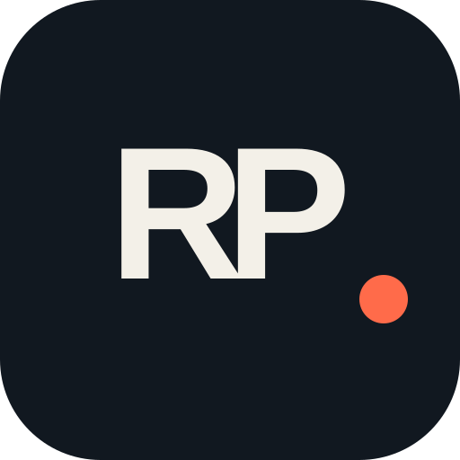

<div align="center">
  

  # Raelvis Paulino — Developer Portfolio

  A personal portfolio focused on clean interfaces, useful products, and thoughtful web development.

  [](https://raelvispaulino.dev)
  [](https://www.linkedin.com/in/raelvis-paulino-8447a42ba/)
  [](https://github.com/Raelvis19)
</div>

## About

This is the official portfolio of **Raelvis Francisco Paulino Almanzar**, a Systems Engineering student and Junior Full-Stack Developer based in San Francisco de Macorís, Dominican Republic.

The site presents my background, technical skills, selected projects, professional goals, and contact information in both English and Spanish.

## Highlights

- Responsive, mobile-first presentation
- English and Spanish content
- Selected projects with live demos and source code
- Custom `RP.` visual identity and favicon
- Open Graph and Twitter previews for shared links
- SEO metadata, structured data, sitemap, and robots configuration
- Accessible semantic heading structure
- Static generation and optimized deployment on Vercel

## Featured projects

| Project | Description | Links |
| --- | --- | --- |
| **Ruticas RD** | Platform for discovering routes and destinations across the Dominican Republic. | [Website](https://ruticasrd.com) · [GitHub](https://github.com/Raelvis19/RuticasRD) |
| **Gestión Médica UCNE** | Offline healthcare desktop system for patients, records, inventory, priorities, and prescriptions. | [Demo](https://gestionmedicaucne.vercel.app/) · [GitHub](https://github.com/Raelvis19/CamargoYLuciano) · [Download](https://ucne-enfermeria.uptodown.com/windows) |
| **PickyRentCar** | Responsive vehicle rental experience with availability and reservation flows. | [Website](https://pickyrentcar-xojx.vercel.app/) · [GitHub](https://github.com/ProgramacionAplicada1/pickyrentcar) |

## Built with


## Run locally

Requirements: Node.js and npm.

```bash
git clone <repository-url>
cd raelvis-portafolio1
npm install
npm run dev
```

Open [http://localhost:3000](http://localhost:3000) in your browser.

### Available commands

```bash
npm run dev    # Start the development server
npm run build  # Create a production build
npm run start  # Run the production build
npm run lint   # Check the codebase with ESLint
```

## Project structure

```text
app/
├── layout.tsx           # Global metadata and structured data
├── page.tsx             # Portfolio content and language switcher
├── globals.css          # Visual system and responsive styles
├── opengraph-image.tsx  # Social sharing preview
├── manifest.ts          # Web app manifest
├── robots.ts            # Crawler rules
└── sitemap.ts           # Search engine sitemap

public/
├── logo-rp.svg          # RP visual identity
├── raelvis-paulino.png  # Profile photograph
└── *-preview.png        # Project previews
```

## Contact

- Website: [raelvispaulino.dev](https://raelvispaulino.dev)
- Email: [contact@raelvispaulino.dev](mailto:contact@raelvispaulino.dev)
- LinkedIn: [Raelvis Paulino](https://www.linkedin.com/in/raelvis-paulino-8447a42ba/)
- GitHub: [@Raelvis19](https://github.com/Raelvis19)

---

<div align="center">
  Designed and built with care by Raelvis Paulino.
</div>
